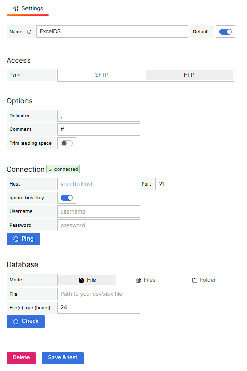

<!-- This README file is going to be the one displayed on the Grafana.com website for your plugin. Uncomment and replace the content here before publishing.

Remove any remaining comments before publishing as these may be displayed on Grafana.com -->
# Excel Datasource

Load multiple csv/excel files data into grafana's dashboards from ftp/sftp servers.

## Overview / Introduction

### Config Editor

## Requirements

- S/FTP server with access to the csv files
- Grafana 7.0+

## Features

- Server Health check.
- Files health check.
- Support multiple formats such as CSV, TSV, LTSV, Fixed-Length Format, JSON and JSON Lines.
- Auto-detect supported files.
- SQL-like query language.
- Data joins between multiple files.
- Support grafana variables.
- SQL syntax highlighting.
- SQL autocomplete.
- SQL validation.
- SQL formatting.

## Documentation

Todo

## Contributing

If you're interested in contributing to this project, please take a look at our [contribution docs](https://github.com/bujupah/bujupah-excel-datasource/blob/master/CONTRIBUTING.md) before getting started.
